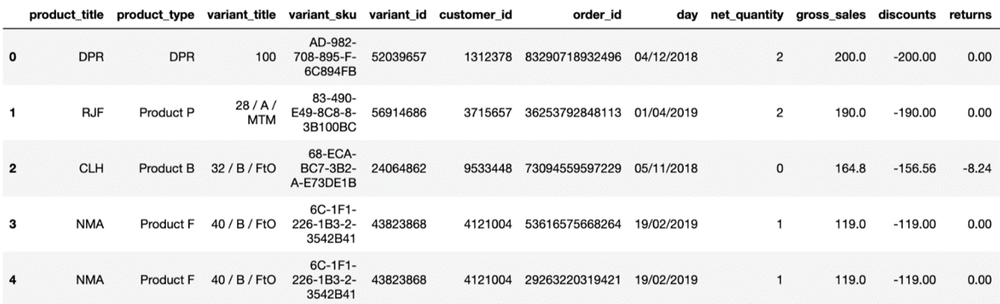
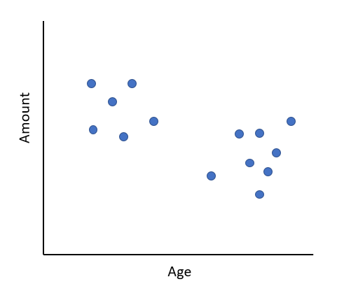
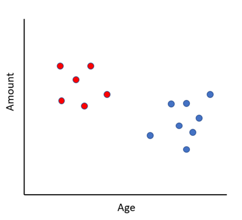

### How machine learning helps your business

Imagine that you opened a convenience store in a university 3 years ago, and every year the store could bring you a considerable revenue. Recently, you decided to open a new convenience store in a very crowded mall. From the last 3 years lessons, you are now quite experienced in inventory management of a convenience store. However, can you directly copy the inventory list from the convenience store to the new opened one? Obviously, no, since in the past the majority customers are university students, now the target customers changed. We all know the importance of providing the services tailored to customers’ needs and interests, but it is not an easy thing to do. In this case, customer segmentation allows you to do so. 

The technique of customer segmentation appeared earlier than the machine learning. It was previously a challenging and time-consuming task, which requires to handle and compute tons of data manually and due the limitation of human beings, the outcomes are not always ideal. But in recent years it has become much easier thanks to machine learning. Today, I will explain the concepts behind the screen by using machine learning models to segment customers.
Let us start with the definition of the machine learning. Machine learning is teaching computers how to solve certain questions. In this post, the question is separating the customers into different groups. Where do computers learn from? The answer is data, usually the data with huge size. In our case, the ideal data should contain thousands of rows, and each row saves the order information of a customer, like something below,

(https://towardsdatascience.com/customer-segmentation-with-machine-learning-a0ac8c3d4d84)

Once we have the dataset, we need to select a tool to help us to find the internal relationship hidden in this dataset. One of the most common relationship is linear relationship, like the relationship between the price and size of a house. In customer segmentation, I would like to use a tool called DBSCAN.  DBSCAN interprets each row as a point in a high dimensional space (the number of dimensions is equal to the number of columns). Hence each point represents a unique customer. High dimensional space is always hard to image for human beings. I would like to use an example with only two columns, age of the customers and the amount of money they spend in the store monthly. Then we could draw a scatter plot as shown,

Now, let’s understand how DBSCAN form customer groups:
- Pick a random point and label it a colour
- Spread the colour of the points to all its neighbours (the points close to it)
- Check all the neighbour points whether they have neighbours. If yes, spread the colour as well.
- When all the neighbours are labeled the color, pick a new point without labeled and repeat the former steps
- At the end, there might be some points left which are not close to any other points. In this case, we would call them noise points. Ideal we could get something like below,

Succeed! Based on the customers features, age and the amount of money they spent on the store, we are able to divide them into two groups and each group has the similar customer behaviors. Under the help of the customer segmentation, you could have a clear idea of how to differentiate your company to the best solution for customer individual needs. Customer segmentation can also help in pricing, product recommendations, etc. 

However, you may have noticed that the real situation is much more complex than I explained before. The first question may be on the top of your head is how close for the points can be regarded as ‘close’. Unfortunately, the machine is not smart enough to figure it out by itself. It is the parameter you should tell the machine at very first. Besides, you should tell the machine what is the minimum number points that can be considered as a group. For example, if we have the information of 1000 unique customers, and there are two points are far away from others, but they are very very close to each other, do you want to label them as a group? Maybe not, since in real life, it is only meaningful, when we have a few groups and, in each group, they have the similarity we are interested in.  Hence, it is crucial to pick optimal values for former two parameters. No one has idea about which value should be chosen, and the only way is trying different values, which sometimes is a frustrating thing. 

Furthermore, DBSCAN is not the only tool for customer segmentation. There are also many other tools. Although the concepts are different, they all try to classify the close points into the same group. Different tools have their own pro and cons. To select a good tool is also tricky.

Overall, under the help of machine learning, customer segmentation could be a powerful tool in marketing. But to get a useful result, it still needs human knowledge and judgment.
